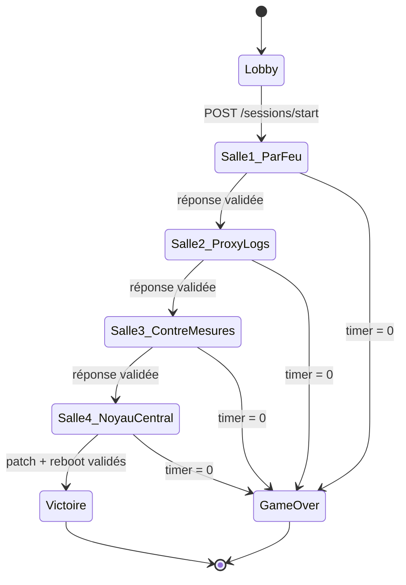
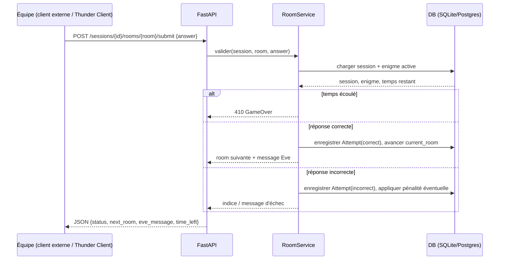
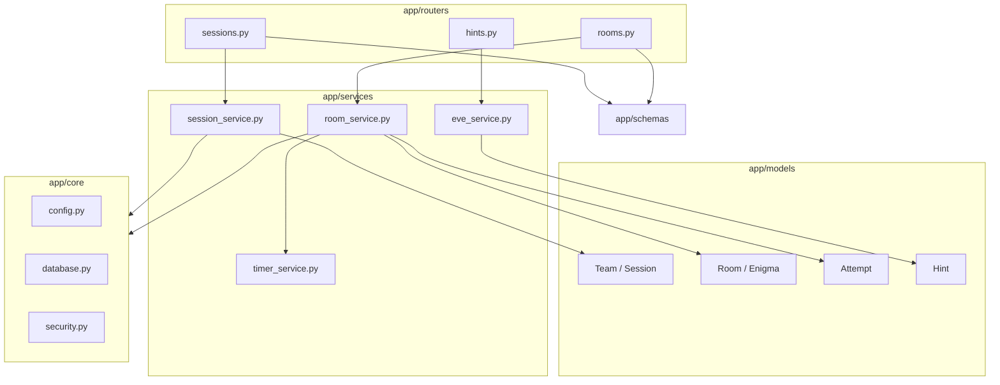
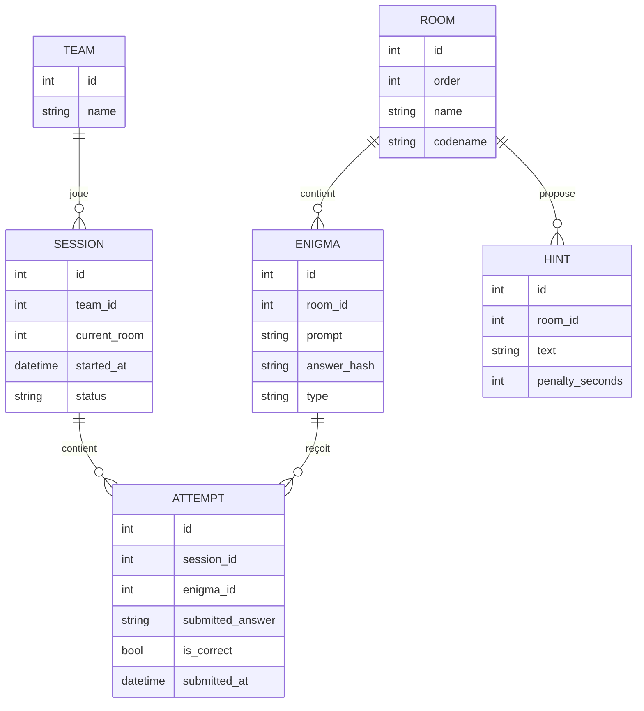
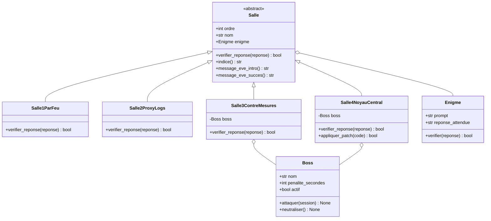

# Root Override — Architecture Back-End

Escape game 100% back-end (pas de front à coder). L'API expose l'état du jeu,
valide les réponses des 4 salles, gère le minuteur de 60 min et les indices d'Eve.

## 1. Machine à états du jeu



## 2. Séquence : soumission d'une réponse



## 3. Composants applicatifs (dossiers `app/`)



## 4. Modèle de données



## 4bis. Hiérarchie métier (héritage `Salle`, `Boss`, `Enigme`)

Cette couche est **pure logique Python**, séparée des modèles SQLAlchemy (section 4).
Elle vit dans `app/domain/` et encapsule les règles du jeu ; les modèles DB ne
font que persister l'état (session, tentatives, temps restant). Le
`room_service.py` fait le pont : il charge l'état DB, instancie la bonne
sous-classe de `Salle`, appelle ses méthodes, puis persiste le résultat.



Points clés :

- `Salle` est **abstraite** (ABC + `@abstractmethod`) : elle impose le contrat
  (`verifier_reponse`, `indice`, messages d'Eve) mais chaque salle a sa propre
  logique d'énigme dans sa sous-classe.
- `Boss` modélise l'IA adverse. Dans l'histoire elle "attaque" activement en
  Salle 3 (la boucle de rétroaction à désamorcer) et réapparaît en Salle 4
  (le noyau corrompu à patcher) — d'où la composition `Salle3`/`Salle4 o-- Boss`
  plutôt qu'un héritage : le Boss n'est pas une salle, c'est un adversaire
  qu'une salle peut contenir.
- `Enigme` reste une classe simple (pas besoin d'héritage si la logique de
  vérification est juste "comparer une réponse attendue") — sauf si tu veux
  plusieurs *types* d'énigmes (QCM, calcul, texte libre) : dans ce cas
  `Enigme` peut elle-même devenir abstraite avec des sous-classes
  `EnigmeTexte`, `EnigmeQCM`, etc.
- Chaque `Salle1ParFeu`, `Salle2ProxyLogs`, etc. ne redéfinit que
  `verifier_reponse()` (et éventuellement `indice()`), tout le reste est
  hérité de `Salle` → c'est l'endroit où le polymorphisme est visible et
  évaluable par un correcteur.

Squelette minimal (`app/domain/salles.py`) :

```python
from abc import ABC, abstractmethod

class Enigme:
    def __init__(self, prompt: str, reponse_attendue: str):
        self.prompt = prompt
        self.reponse_attendue = reponse_attendue

    def verifier(self, reponse: str) -> bool:
        return reponse.strip().lower() == self.reponse_attendue.strip().lower()


class Salle(ABC):
    ordre: int
    nom: str

    def __init__(self, enigme: Enigme):
        self.enigme = enigme

    def verifier_reponse(self, reponse: str) -> bool:
        return self.enigme.verifier(reponse)

    @abstractmethod
    def indice(self) -> str: ...

    @abstractmethod
    def message_eve_intro(self) -> str: ...

    def message_eve_succes(self) -> str:
        return "Bien joué, tu peux avancer."


class Salle1ParFeu(Salle):
    ordre = 1
    nom = "Le Pare-Feu de Périphérie"

    def indice(self) -> str:
        return "Regarde le masque de sous-réseau..."

    def message_eve_intro(self) -> str:
        return "Attention, ils vont tracer ton IP, fais vite."


class Boss:
    def __init__(self, nom: str, penalite_secondes: int = 60):
        self.nom = nom
        self.penalite_secondes = penalite_secondes
        self.actif = True

    def attaquer(self, session) -> None:
        session.temps_restant -= self.penalite_secondes

    def neutraliser(self) -> None:
        self.actif = False


class Salle3ContreMesures(Salle):
    ordre = 3
    nom = "La Matrice des Contre-Mesures"

    def __init__(self, enigme: Enigme):
        super().__init__(enigme)
        self.boss = Boss(nom="Boucle de rétroaction")

    def indice(self) -> str:
        return "La boucle se répète toutes les X secondes, trouve le motif."

    def message_eve_intro(self) -> str:
        return "Il attaque en boucle, désamorce vite le processus !"

    def verifier_reponse(self, reponse: str) -> bool:
        correct = super().verifier_reponse(reponse)
        if correct:
            self.boss.neutraliser()
        return correct
```

Ensuite, un petit "registre" fait le lien salle DB ↔ classe Python (utile dans
`room_service.py`) :

```python
SALLES: dict[int, type[Salle]] = {
    1: Salle1ParFeu,
    2: Salle2ProxyLogs,
    3: Salle3ContreMesures,
    4: Salle4NoyauCentral,
}
```

## 5. Endpoints prévus (v1)

| Méthode | Route | Rôle |
|---|---|---|
| POST | `/sessions/start` | crée une session d'équipe, démarre le timer |
| GET | `/sessions/{id}/state` | salle actuelle, temps restant, statut |
| GET | `/sessions/{id}/rooms/{room}/enigma` | énoncé de l'énigme active (jamais la réponse) |
| POST | `/sessions/{id}/rooms/{room}/submit` | valide une réponse, fait avancer la session |
| GET | `/sessions/{id}/rooms/{room}/hint` | indice d'Eve (avec pénalité de temps éventuelle) |
| POST | `/sessions/{id}/rooms/4/reboot` | validation finale du patch + reboot |

## 6. Ordre de développement conseillé

1. Scaffold FastAPI + config + DB (SQLAlchemy) + `.env`
2. Modèles + migrations Alembic (Team, Session, Room, Enigma, Attempt, Hint)
3. Session lifecycle (`start`, `state`, timer serveur)
4. Salle 1 — Pare-feu (logique la plus simple, valide le pipeline complet)
5. Salle 2 — Proxy/Logs
6. Salle 3 — Contre-mesures
7. Salle 4 — Noyau central (patch + reboot final)
8. Indices d'Eve (`hints`) — transverse, peut être fait en parallèle
9. Tests pytest sur chaque salle + tests d'intégration bout en bout
