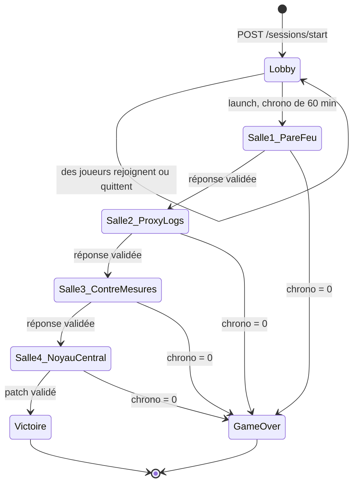
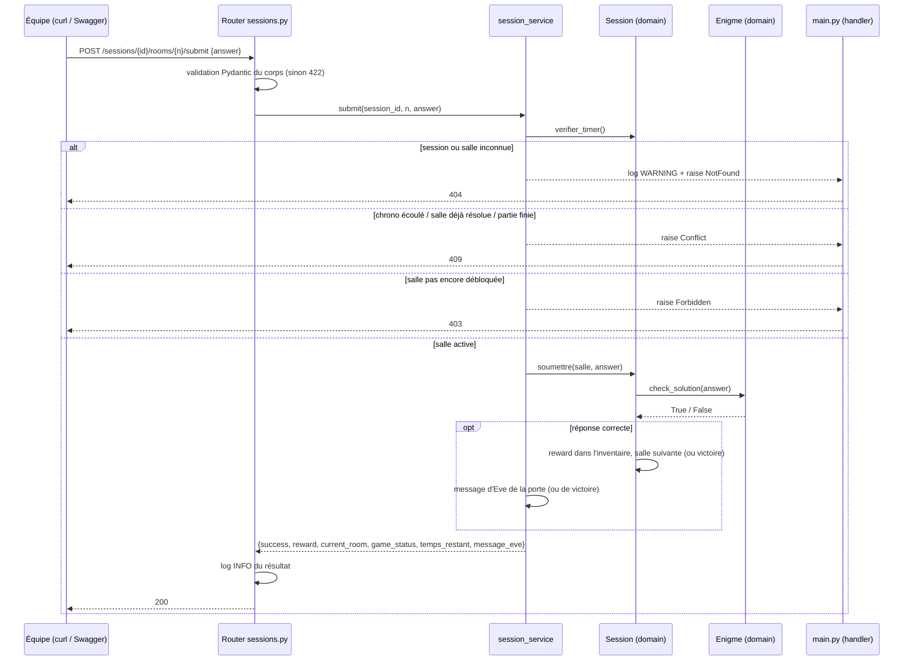
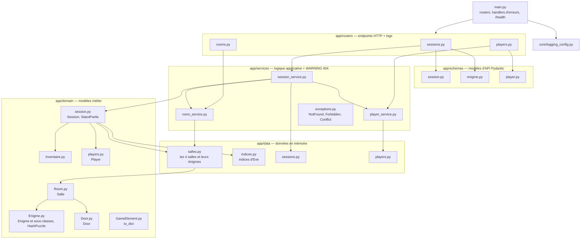
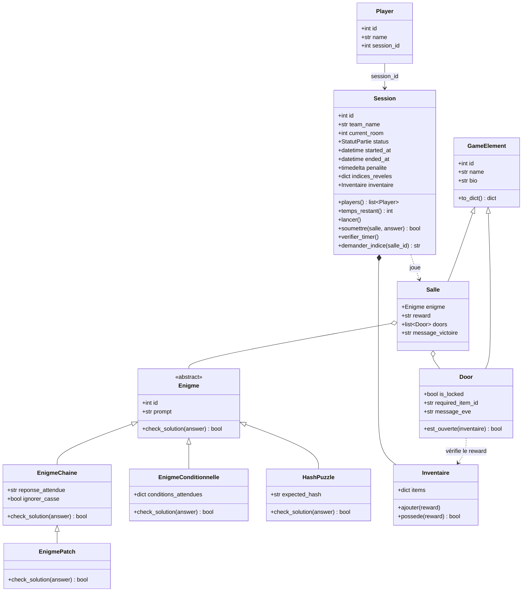

# Root Override — Architecture Back-End

Escape game 100% back-end (pas de front). Une équipe joue via l'API : elle se
constitue dans un lobby, lance la partie, puis doit résoudre 4 salles en
60 minutes. L'API expose l'état du jeu, valide les réponses, gère le chrono,
les portes entre les salles, les indices et les messages de l'IA Eve.

Toutes les données sont **en mémoire** (dicts Python dans `app/data/`) : pas de
base de données, c'est un choix assumé pour ce projet (voir section 8).

Pour tester chaque route à la main : [`tests-curl.md`](tests-curl.md).

## 1. Machine à états d'une partie

```mermaid
stateDiagram-v2
    [*] --> Lobby: POST /sessions/start
    Lobby --> Lobby: des joueurs rejoignent ou quittent
    Lobby --> Salle1_PareFeu: launch, chrono de 60 min
    Salle1_PareFeu --> Salle2_ProxyLogs: réponse validée
    Salle2_ProxyLogs --> Salle3_ContreMesures: réponse validée
    Salle3_ContreMesures --> Salle4_NoyauCentral: réponse validée
    Salle4_NoyauCentral --> Victoire: patch validé
    Salle1_PareFeu --> GameOver: chrono = 0
    Salle2_ProxyLogs --> GameOver: chrono = 0
    Salle3_ContreMesures --> GameOver: chrono = 0
    Salle4_NoyauCentral --> GameOver: chrono = 0
    Victoire --> [*]
    GameOver --> [*]
```

Côté code, ces états correspondent à `StatutPartie` (`lobby`, `in_progress`,
`victory`, `game_over`) et à `Session.current_room` (1 à 4).

## 2. Séquence : soumission d'une réponse

```mermaid
sequenceDiagram
    participant Equipe as Équipe (curl / Swagger)
    participant API as Router sessions.py
    participant Svc as session_service
    participant Session as Session (domain)
    participant Enigme as Enigme (domain)
    participant Main as main.py (handler)

    Equipe->>API: POST /sessions/{id}/rooms/{n}/submit {answer}
    API->>API: validation Pydantic du corps (sinon 422)
    API->>Svc: submit(session_id, n, answer)
    Svc->>Session: verifier_timer()
    alt session ou salle inconnue
        Svc-->>Main: log WARNING + raise NotFound
        Main-->>Equipe: 404
    else chrono écoulé / salle déjà résolue / partie finie
        Svc-->>Main: raise Conflict
        Main-->>Equipe: 409
    else salle pas encore débloquée
        Svc-->>Main: raise Forbidden
        Main-->>Equipe: 403
    else salle active
        Svc->>Session: soumettre(salle, answer)
        Session->>Enigme: check_solution(answer)
        Enigme-->>Session: True / False
        opt réponse correcte
            Session->>Session: reward dans l'inventaire, salle suivante (ou victoire)
            Svc->>Svc: message d'Eve de la porte (ou de victoire)
        end
        Svc-->>API: {success, reward, current_room, game_status, temps_restant, message_eve}
        API->>API: log INFO du résultat
        API-->>Equipe: 200
    end
```

Le chrono n'a pas de tâche de fond : `verifier_timer()` est appelé à chaque
accès à une session et bascule en `game_over` si le temps est écoulé.

## 3. Organisation du code (`app/`)

```mermaid
flowchart TD
    MAIN[main.py<br/>routers, handlers d'erreurs, /health]
    CORE[core/logging_config.py]
    subgraph ROUTERS["app/routers — endpoints HTTP + logs"]
        R1[sessions.py]
        R2[rooms.py]
        R3[players.py]
    end
    subgraph SCHEMAS["app/schemas — modèles d'API Pydantic"]
        SC1[session.py]
        SC2[enigme.py]
        SC3[player.py]
    end
    subgraph SERVICES["app/services — logique applicative + WARNING 404"]
        SV1[session_service.py]
        SV2[player_service.py]
        SV3[room_service.py]
        SV4[exceptions.py<br/>NotFound, Forbidden, Conflict]
    end
    subgraph DOMAIN["app/domain — modèles métier"]
        D1[session.py<br/>Session, StatutPartie]
        D6[Inventaire.py]
        D2[Enigme.py<br/>Enigme et sous-classes, HashPuzzle]
        D3[Room.py<br/>Salle]
        D7[Door.py<br/>Door]
        D4[players.py<br/>Player]
        D5[GameElement.py<br/>to_dict]
    end
    subgraph DATA["app/data — données en mémoire"]
        DA1[salles.py<br/>les 4 salles et leurs énigmes]
        DA2[indices.py<br/>indices d'Eve]
        DA3[sessions.py]
        DA4[players.py]
    end

    MAIN --> ROUTERS
    MAIN --> CORE
    R1 --> SC1
    R1 --> SC2
    R3 --> SC3
    R1 --> SV1
    R2 --> SV3
    R3 --> SV2
    SV1 --> SV2
    SV1 --> SV3
    SV1 --> D1
    SV1 --> DA3
    SV2 --> DA4
    SV3 --> DA1
    D1 --> DA1
    D1 --> DA2
    D1 --> D4
    D1 --> D6
    D3 --> D2
    D3 --> D7
    DA1 --> D3
```

| Dossier | Rôle |
|---|---|
| `main.py` | Monte les routers, active les logs, traduit les erreurs métier en codes HTTP et rattrape les erreurs inattendues (500). |
| `routers/` | Uniquement les routes : reçoit la requête validée, appelle un service, journalise l'action, renvoie le résultat. |
| `schemas/` | Modèles Pydantic de l'API : valide les entrées (422) et décrit les sorties (`SessionState`, `PlayerRead`). |
| `services/` | Logique applicative : règles d'accès (lobby, salle verrouillée, partie finie), équipes, soumissions, indices, message d'Eve à l'ouverture d'une porte. Ne connaît pas HTTP : lève `NotFound`, `Forbidden` ou `Conflict`. |
| `domain/` | Modèles métier en Python pur : vérifier une réponse, avancer, chrono, inventaire, portes. |
| `data/` | Les données « en dur » et les dicts qui servent de stockage. |
| `core/` | Configuration transverse (logging). |

**Pourquoi pas de dossier `models/` ?** Dans un projet avec base de données,
`models/` contient les modèles ORM (les tables). Ici il n'y a pas de base : nos
modèles sont de deux sortes, rangés selon leur rôle pour ne pas les mélanger :

- `domain/` : les **modèles métier** (`Session`, `Salle`, `Door`, `Enigme`,
  `Inventaire`, `Player`),
  des classes Python qui portent les règles du jeu ;
- `schemas/` : les **modèles d'API** Pydantic, qui ne font que valider et
  sérialiser.

## 4. Modèle du domaine

```mermaid
classDiagram
    class GameElement {
        +int id
        +str name
        +str bio
        +to_dict() dict
    }
    class Salle {
        +Enigme enigme
        +str reward
        +list~Door~ doors
        +str message_victoire
    }
    class Door {
        +bool is_locked
        +str required_item_id
        +str message_eve
        +est_ouverte(inventaire) bool
    }
    class Enigme {
        <<abstract>>
        +int id
        +str prompt
        +check_solution(answer) bool
    }
    class EnigmeChaine {
        +str reponse_attendue
        +bool ignorer_casse
        +check_solution(answer) bool
    }
    class EnigmeConditionnelle {
        +dict conditions_attendues
        +check_solution(answer) bool
    }
    class EnigmePatch {
        +check_solution(answer) bool
    }
    class HashPuzzle {
        +str expected_hash
        +check_solution(answer) bool
    }
    class Session {
        +int id
        +str team_name
        +int current_room
        +StatutPartie status
        +datetime started_at
        +datetime ended_at
        +timedelta penalite
        +dict indices_reveles
        +Inventaire inventaire
        +players() list~Player~
        +temps_restant() int
        +lancer()
        +soumettre(salle, answer) bool
        +verifier_timer()
        +demander_indice(salle_id) str
    }
    class Inventaire {
        +dict items
        +ajouter(reward)
        +possede(reward) bool
    }
    class Player {
        +int id
        +str name
        +int session_id
    }

    GameElement <|-- Salle
    GameElement <|-- Door
    Enigme <|-- EnigmeChaine
    Enigme <|-- HashPuzzle
    Enigme <|-- EnigmeConditionnelle
    EnigmeChaine <|-- EnigmePatch
    Salle o-- Enigme
    Salle o-- Door
    Door ..> Inventaire : vérifie le reward
    Session *-- Inventaire
    Session ..> Salle : joue
    Player --> Session : session_id
```

Points clés :

- **Polymorphisme sur les énigmes** : `Enigme` est abstraite (`ABC`) et impose
  `check_solution()`. Chaque sous-classe a sa façon de vérifier :
  - `EnigmeChaine` (salles 1 et 2) compare une chaîne, avec ou sans casse ;
  - `EnigmeConditionnelle` (salle 3) compare un dict clé par clé, **type
    compris** (sinon `1` serait accepté à la place de `true`) ;
  - `EnigmePatch` (salle 4) hérite d'`EnigmeChaine` et ignore en plus casse
    et espaces ;
  - `HashPuzzle` compare l'empreinte SHA-256 de la réponse : la réponse
    attendue n'est jamais stockée en clair. Elle est prête et testée, mais
    aucune salle ne l'utilise pour l'instant.
- **Une seule source de vérité par salle** : chaque `Salle` porte son énigme,
  son reward et sa porte, dans `app/data/salles.py`.
- **Portes (`Door`)** : chaque salle 1 à 3 a une porte vers la suivante. Elle
  s'ouvre quand l'équipe possède le reward de la salle (`est_ouverte`), et
  porte le message qu'Eve donne à ce moment-là. La salle 4 n'a pas de porte
  mais un `message_victoire`.
- **`to_dict()`** : `GameElement` sait se convertir en dict ; c'est ce que
  renvoie la carte publique `GET /rooms/{id}`.
- **Lien joueur ↔ équipe** : porté uniquement par `Player.session_id`.
  `Session.players` filtre les joueurs au lieu de tenir une seconde liste.
- **Inventaire partagé** : un booléen par reward de salle, commun à toute
  l'équipe. La salle 4 n'a pas de reward : la réussir fait gagner.

### Les 4 salles

| # | Salle | Type d'énigme | Principe |
|---|---|---|---|
| 1 | Pare-Feu | `EnigmeChaine` (casse ignorée) | Décoder une clé en Base64 |
| 2 | Proxy & Logs | `EnigmeChaine` (casse exacte) | Retrouver le token admin accepté dans des logs |
| 3 | Contre-Mesures | `EnigmeConditionnelle` | Renvoyer un état JSON corrigé (mêmes clés, mêmes types) |
| 4 | Noyau Central | `EnigmePatch` | Écrire la commande de reboot |

### Chrono et indices d'Eve

- Durée : `DUREE_PARTIE` = 60 min, à partir du `launch`.
- `temps_restant = DUREE_PARTIE - pénalités - temps écoulé`. Il vaut `None`
  en lobby et reste figé à la victoire (`ended_at`).
- Eve a 3 indices par salle (`app/data/indices.py`), du plus vague au plus
  précis. Chaque indice coûte `PENALITE_INDICE` = 2 min, et peut donc
  provoquer le game over.
- Quand une salle est résolue, la réponse de `submit` contient `message_eve` :
  le message de la porte qui s'ouvre (salles 1 à 3) ou le message de victoire
  (salle 4). Il vaut `null` après une mauvaise réponse.

## 5. Endpoints

| Méthode | Route | Rôle |
|---|---|---|
| GET | `/` | Health check simple |
| GET | `/health` | État du service : statut, nom du jeu, version du moteur |
| GET | `/rooms/` | Ids des salles |
| GET | `/rooms/{id}` | Nom et bio d'une salle (carte publique, sans énoncé) |
| GET | `/players/` | Liste des joueurs |
| GET | `/players/{id}` | Un joueur |
| POST | `/players/` | Créer un joueur |
| PUT | `/players/{id}` | Renommer un joueur |
| DELETE | `/players/{id}` | Supprimer un joueur |
| POST | `/sessions/start` | Créer une équipe, en lobby |
| GET | `/sessions/{id}/state` | État : salle, statut, temps restant, pénalités, joueurs, inventaire |
| POST | `/sessions/{id}/players` | Un joueur rejoint l'équipe |
| DELETE | `/sessions/{id}/players/{player_id}` | Un joueur quitte l'équipe |
| POST | `/sessions/{id}/launch` | Lancer la partie, démarrer le chrono |
| GET | `/sessions/{id}/rooms/{n}/enigma` | Énoncé d'une salle débloquée (jamais la réponse) |
| POST | `/sessions/{id}/rooms/{n}/submit` | Répondre, `{"answer": "..."}` (salles 1, 2, 4), avec `message_eve` en cas de succès |
| POST | `/sessions/{id}/rooms/3/submit` | Répondre, `{"conditions": {...}}` (salle 3) |
| POST | `/sessions/{id}/rooms/{n}/hint` | Demander l'indice suivant à Eve (-2 min) |
| GET | `/sessions/{id}/rooms/{n}/hints` | Relire les indices déjà obtenus (gratuit) |

### Codes d'erreur

| Code | Cas |
|---|---|
| `404` | Session, salle, joueur ou route inconnus |
| `403` | Salle pas encore débloquée |
| `409` | Partie pas lancée, déjà lancée ou terminée ; salle déjà résolue ; temps écoulé ; plus d'indice ; conflit d'équipe |
| `422` | Corps de requête invalide (voir les contraintes ci-dessous) |
| `500` | Erreur inattendue : `{"detail": "Erreur interne"}`, trace complète dans les logs |

### Contraintes de validation (schemas)

| Champ | Contrainte |
|---|---|
| `team_name` | 1 à 50 caractères, pas uniquement des espaces |
| `name` (joueur) | 3 à 30 caractères |
| `player_id` | entier strictement positif |
| `answer` | 1 à 200 caractères, pas uniquement des espaces |
| `conditions` | 1 à 10 clés ; valeurs booléen, entier ou chaîne |

## 6. Journalisation

Configurée une seule fois dans `app/core/logging_config.py` (appelée par
`main.py`), au format `date | niveau | module | message`. Chaque module a son
logger (`logging.getLogger(__name__)`).

| Niveau | Quoi | Où |
|---|---|---|
| `INFO` | Recherches : liste ou lecture d'une salle, d'un joueur, d'une session | `routers/` |
| `INFO` | Actions : création de session, joueur ajouté ou retiré, lancement, réponse soumise (avec `success`), indice demandé, CRUD joueurs | `routers/` |
| `WARNING` | Ressource inexistante : joueur, salle ou session introuvable, joueur absent de l'équipe (juste avant chaque `NotFound`) | `services/` |
| `ERROR` | Exception inattendue, avec la trace complète (`logger.exception`) ; le client reçoit une 500 | handler global de `main.py` |

Le log `INFO` d'un router est écrit **après** l'appel au service : une action
refusée n'est donc pas journalisée comme réussie. Les refus de règles métier
(403, 409) ne sont pas des `WARNING` : ce ne sont pas des ressources
inexistantes, mais le comportement normal du jeu.

## 7. Tests

- `tests/` : suite pytest (`python -m pytest -q`) sur les rooms, les joueurs,
  les énigmes (dont `HashPuzzle`), les portes, les services appelés sans HTTP,
  les logs (INFO, WARNING, ERROR), les contraintes de validation, et tout le
  déroulé d'une session (lobby, équipe, progression, victoire, chrono,
  game over, indices, messages d'Eve). Le chrono est testé en reculant `started_at`
  plutôt qu'en attendant 60 min.
- `tests/conftest.py` remet les joueurs et les sessions à zéro entre chaque
  test, car ce sont des dicts globaux.
- `tests/curl_requests.sh` : rejoue une partie complète contre un vrai serveur
  et vérifie le code HTTP de chaque requête ; il peut être relancé sans
  redémarrer le serveur.

## 8. Choix de conception

- **Pas de base de données** : le stockage en mémoire suffit pour le périmètre
  du projet. Tout repart à zéro au redémarrage du serveur.
- **Services sans HTTP** : les services lèvent des exceptions métier
  (`NotFound`, `Forbidden`, `Conflict`) et c'est `main.py` qui choisit le code
  HTTP. On peut donc tester et réutiliser la logique sans passer par FastAPI.
- **Pas de tâche de fond pour le chrono** : le temps est recalculé à chaque
  accès à la session, ce qui est plus simple et donne le même résultat.
- **Route dédiée pour la salle 3** : son corps est un dict et non une chaîne.
  Elle est déclarée avant la route générique pour que FastAPI la choisisse
  en premier, et la validation du format reste dans Pydantic.
- **Indice en `POST`** : demander un indice modifie l'état (pénalité de temps),
  ce qui n'est pas le rôle d'un `GET`. La relecture, elle, est un `GET`.
- **L'énoncé passe par la session** : `/rooms/{id}` ne donne que la carte
  publique, pour qu'une équipe ne puisse pas lire une salle qu'elle n'a pas
  encore débloquée.
